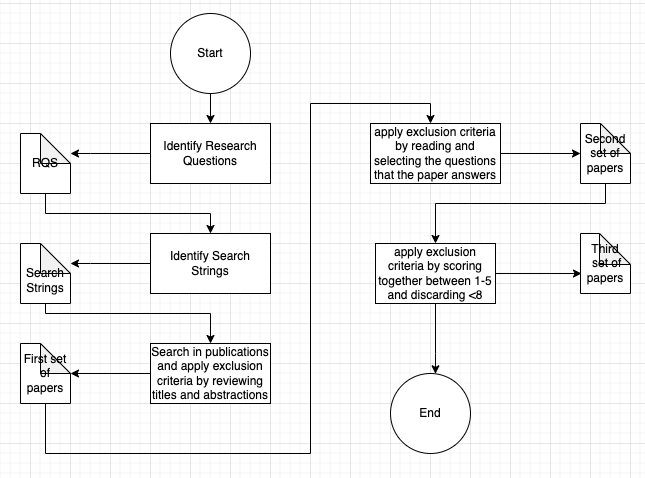
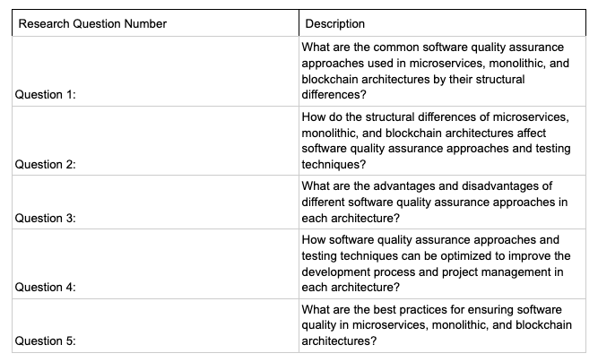
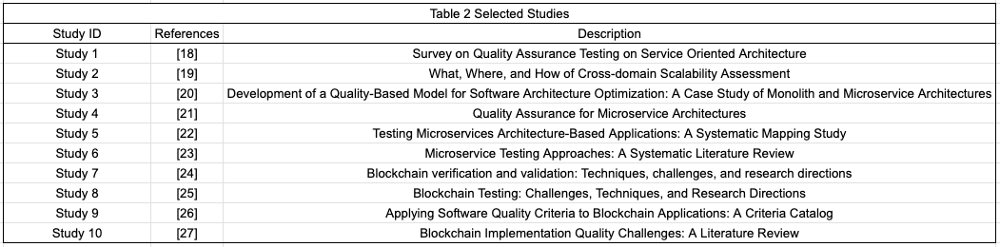
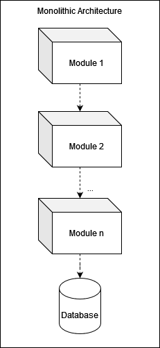
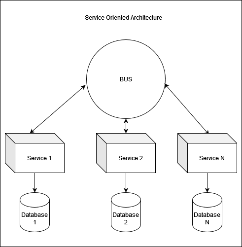
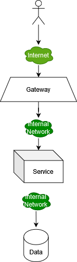

# Exploring the Impact of Architectural Differences on Quality Assurance Approaches: A Comparative Study of Microservices, Monolithic, and Blockchain Architectures

## Abstract

## I. Introduction

 
In recent years, there has been a huge trend to shift architectural designs in industries from traditional monolithic architectures to more flexible, scalable solutions. Increasing scale of the system and cost also make stake holders to invest these kind of solutions. Such as banking systems that requires constantly feature generation. While migrating their system also noticed that in order to implement properly, quality assurance part also needs to be addressed. They faced problems especially while shifting from monolithic to more appropriate architectures such as SOA which is implementation of monolithic, microservice and blockchain. In order to migrate their functional and nonfunctional requirements, quality assurance practices took place from design phase to maintenance in order to provide more controllable and problem addressed environment. For example monitoring actives let migrators to observe problematic sides of the decomposing centralized system. Further it enables migrators to foresee about how to control test and maintain new system with comparing functionalities of the old system. Architectural selection between monolithic, microservice and blockchain relies on their specifications and benefits that provided by nature of the architectures such as immutable registry, zero trust management, decomposed components, deployability. Monolithic architecture, losing its popularity because of been tightly-coupled components, being single centralized system. These structures causes poor adaptability, scalability and being hard to avoid possible diverse faults. Industry changed attention to microservice architecture after recognizing these drawbacks with loosely-coupled, granular components. This portable and modular practice enabled independent development, deployment and scaling of the provide components which provides better agility and scalability. Industry is also exploring the blockchain architecture, its potential data management and trust management mechanisms. Blockchain architecture offers more decentralized and immutable records, further it also provides better security and transparency. By exploring and investing these architectures, they endeavor to create more resilient, scalable, innovative and also affordable systems for the future.
 
Looking for a better approach leads decision-makers to create a better solution after insufficiencies come to light. Monolithic is unable to provide desired features such as deployability and scalability-related features. SOA got to help. Centralized bus-dependent components started to take the place of the monolithic systems. With this awakening, the necessity for quality began to be understood and improved because management, monitoring, testing, and maintenance activities changed. Change brings defects, and in order to avoid these defects, developers and decision-makers started to look for practices for defect detection and avoidance activities. Besides the quality assurance activities formerly used, this new approach requires additional attention to provide quality assurance. Decentralized monitoring, error tracking systems, automated deployment, and scalability concerns pushed them to create new infrastructure. After the SOA, with the increase in scalability and deployability requirements Microservice architecture takes place in the literature. Microservices have much more to offer, such as the ability to use different programming languages and engines. But as a drawback, Microservices place an additional networking layer between components, and communication protocols need to be managed. This new layer is dependent on the underlying network and its capabilities. Thanks to improvements in internet infrastructure, globally distributed Microservices have become more common. After infrastructure improvements, communication between nodes in a network (the internet) became affordable and easy. These improvements led to the implementation of a network protocol, which is blockchain technology. Satoshi Nakamato proposes a document that provides a protocol that provides instructions for managing data in a network by network participants. A decentralized, immutable lager. Then a very complete implementation of blockchain comes up, which is Ethereum. Ethereum offers much more complex features for its users. That's why we called it "architectures near other architectures. Communication, security (part of it), immutability, and other features made blockchain a noticeable alternative for some microservice domains. But as a new architectural option, it needs attention, especially on the quality aspect. Globally decentralized labor requires global infrastructure to be observed and maintained. Luckily, built-in infrastructure provides some quality assurance requirements. For example, completely open public chains provide all their contents to the public, which means any node in the network can observe and analyze them. But more critical parts still need to be handled, such as dynamic testing. We have been motivated to provide this paper in order to create a literature review to improve quality activities by comparing quality attributes, tools, and approaches with other architectures. We have gathered tools and procedures from academic articles in order to interfere extensive comparison of architectural approaches. Our research technique, which is described in the research methodology section, was used to choose these papers. The effectiveness and applicability of the acquired tools and methodologies for Monolithic, Microservice and BLockchain are then assessed. A straight comparison might not be possible because each design has different requires for quality attribute requirements. We nevertheless consider common factors like communication layers and coding best practices. We compare design and development methodologies to evaluate their overall quality by taking into account these commonalities. Additionally, all architectures have different challenges by their nature with testing, monitoring, scalability, and deployment. As a result, we also evaluated the effectiveness of quality control procedures in other architectural situations. A monitoring tool, for instance, may not be as useful for a Monolithic architecture as it is for distributed systems. On the other hand, Microservice and Blockchain designs may be able to benefit from testing automation tools used for unit testing in Monolithic structures. We intend to provide more knowledge about the advantages and disadvantages of various tools and methods within each architectural paradigm by making these comparisons and evaluations. This study improves the understanding of their efficiency and enables us to choose and use architectural techniques with knowledge.
 

## II. Research Method

In this study, a systematic literature review (SLR) research method is used to explore the impact of architectural differences on quality assurance approaches. SLR is a research method that uses systematic and transparent approach to identify, select and evaluate an existing literature on a specific research topic. The purpose of using SLR is to provide comprehensive, unbiased and systematic summary of the available evidence related to the research question. We have followed the process steps as shown in Figure 1. At the start we decided our research problem and we came up with research related questions to guide our SLR. Then we have selected our keywords for our search strings and we have searched among publications to find related papers to our SLR which are explained in Phase One.

During the initial stages of the research, we searched publication domains, such as Google Scholar, using specific query strings, such as the following:
* (monolith*) AND "software architecture" AND "quality assurance"
* (microservice*) AND "software architecture" AND "quality assurance"
* (blockchain*) AND "software architecture" AND "quality assurance"
* (monolith*) AND (microservice*) AND (blockchain*) AND "software architecture" AND "quality assurance"

 In our first step both of us started searching for a related papers and we made a first set out of these papers. To select these papers we searched our search string and we read the titles and abstraction parts of these papers and if according to our observation, we believe that this can be useful we added that to the set using DOI ISBN and Web page link of document in Source-Question Relation Report template.We also labeled each paper with the relevant question that paper can answer. While doing all this, we did research separately from each other. We wrote down our opinions on the papers we assumed that might be useful and marked the questions we speculated might be answered. We had total 31 paper in our first set.For each paper we prepared Source-Question Relation Report and these reports are saved in private [google drive folder](https://drive.google.com/drive/folders/1eaKwZmwAPQW0qsri6mxIebG0j68r48uA?usp=sharing) between us. In the second step which we explain in Phase Two, we read the papers to see if they answers to our questions and in this step we eliminated 12 paper because we believed they answer a few of our questions and they are not going to be useful in our study.At the end of this step we had 19 papers and this was our second set of papers. After this step we came together and reviewed each paper by making a table for each question answered, Total Score and our final decision for each paper.The have selected the questions answered in this paper, scored importance of this paper between 1-5, if sum of our score was bigger than 8, we have selected this paper and colored green in the final decision for the paper.In some papers our sum for the paper was 8 so we colored that one orange to say that in this paper we were in doubt.Details of this process will be explained in phase 3.In the end we had 10 selected papers and one doubtful paper in our final pool.

### Goal Metric Question

Goal-Question-Metric (GQM) is a structured approach to defining and measuring software quality.It is a useful tool for us to ensure that right measurements are collected and result of these measurements are being used to improve the quality. We have used GMQ to frame our research and we defined our questions given in Table 1.

Using the GQM approach in the form of a question-driven has been a guide for us on the way to the goal. By identifying the questions, we were able to target specific points about quality that needed to be answered. Thanks to these questions, we determined the scope of the study. The GQM approach helps us reach the goal by asking the right questions and helps us collect the metrics we want to collect.

### Phase One
After identifying the problem, we scheduled a meeting once a week. In our first meeting, we decided to determine the search strings related to our problem and find about 30 articles about them, read the title and abstract parts of these articles, and we appraise them according to their relevance with our questions, we decided to upload them to a common google drive folder using the Source-Question Relation Report format we have prepared for each article. We gave 1 week to find these articles, and at the end of 1 week, we were ready to start phase 1.
  
In the first phase of our systematic literature review, we used a systematic and transparent approach to identify, select, and evaluate papers on the topic of the impact of architectural differences on quality assurance approaches. We began by defining our research problem and coming up with research-related questions to guide our SLR. We then selected keywords for our search strings and searched among publications to find related papers. We read the titles and abstracts of the papers to determine their relevance, and we labeled each paper with the relevant question that it could answer. While doing all this, we did research separately from each other. In our initial assessment, we recorded our reflections on the papers we deemed potentially valuable and highlighted the inquiries we believed could be addressed. Ultimately, our first set comprised a total of 31 papers.
  
### Phase Two
  
After phase 1 was over, we decided to plan for phase 2 the next week. Our plan was to read in more detail and eliminate the articles that we assumed answered few questions so that we could not eliminate a little of the 31 articles we had before meeting. After giving 1 week for this, we met at the end of 1 week and presented the articles that could be eliminated to each other, we eliminated the articles that we were partners with, and we decided to delete or not delete according to the result by expressing our own views on the articles we were not partners with.To do this, we come together and reviewed each paper with our own comments. Using the comments we wrote, we talked about the weak and strong points of the articles, determined whether they answered our research questions and we have used exclusion criteria to remove some studies, so that our study is unbiased and the results are credible. 

In our case of SLR, our exclusion criteria as follows:
* Articles that are about data quality, not about software quality
* Articles that are not about software quality or software quality attribute or qa method
* Articles that are too specific on domain or architecture

These exclusion criterias helped us exclude certain articles from our study. This helped us strengthen the credibility of our results. At the end of this process, we have 19 articles left. These articles are stored in another google drive folder to take a look when needed.

### Phase Three
After Phase 2 was over, we gave each other 1 week. During this time, we will read all the articles in detail, decide in detail whether they fit our GQM questions or not, and finally, we wanted to give this article a score between 1 and 5 and decide together whether to take the next step. We gave our score for each article we read, wrote detailed explanations, and compared the scores we gave when we totaled for Phase 3. If the sum of the points we gave for an article is 8 or more than 8, we decided to choose that article for use. If it is less than 8, we decided not to use it. We were undecided on 1 article. Then we eliminated the undecided and we have 10 articles left. These 10 articles were suitable for our GQM questions and included opinions and studies on the subjects we researched. We decided to use these articles, and in this section, we re-read these articles and marked the places that we consider important and useful in our article.

## III. Literature Review

### Monolithic

Monolithic architecture can be defined as a software design pattern where an application is built as a single, indivisible unit with all components tightly coupled together. It typically includes the user interface, business logic, and data access layers within a single deployable artifact. "Software design can be defined as an activity in which software requirements are analyzed in order to produce a description of the software’s internal structure. As a result, a software architecture is created and used to describe the system’s design at a high level. Thus, software architecture represents the basis for further software development processes" [1]. The design and framework of the software have a huge influence on the system's quality attributes, maintainability, and long-term viability. Quality attributes, maintenance tools, and approaches vary according to the underlying infrastructure and design principles. Architecture that, by its nature, allows dynamic changes survives longer.

Using this design pattern, we build apps that are developed, deployed, and scaled as a single cohesive unit. All modules and components are dependent on each other and packaged together. In the deployment stage, all tightly-coupled components are deployed together. As we approach architecture from a quality perspective, architecture also provides a framework for quality efforts and policies. Defined and selected quality models and approaches need to be confirmed for business and design, or, in other words, architectural, requirements.

Monolithic architecture was much more popular in the old days because of its simplicity, ease of development, and limited technology options. As time passed, our civilization required more. Faster, more complex, and cheaper solutions took place in all parts of our lives. In time, the requirements for complex systems with thousands of components become a problem because even small errors become more problematic. Problems in the deployment and scaling of components independently started to be a wanted feature. 

For example, if you want to change a small feature or fix a bug, you need to create an artifact from scratch and deploy the whole application, even if that is not what you intended. Beside just the size and time-consuming activities caused by tight coupling, even a small change can affect the whole application, and debugging may become a very problematic issue, detecting where it creates defects and solving them without creating any additional errors. In parallel with the improvements in technology, hardware, and infrastructure, it started to lose its popularity.

The industry started to look for better approaches in order to improve their infrastructure and framework design because monolithic applications became problematic to measure and manage. Highly coupled component design, deployment, and scalability problems lead them to loosely coupled designs such as Service Oriented Architecture and Microservices. Decomposition of the services has such benefits as improved scalability, modularization, and deployability. Aside from these beneficial features, quality assurance awareness has become more popular. With this awareness, some common quality attributes have been gathered, such as Coupling, Testability, Security, Complexity, Deployability, and Availability [1]. 

To be able to confirm quality assurance requirements and quality measurements, new architectural designs must be evaluated with respect to their confirmation. Cost effectiveness is one of the major concerns of industry competitors. Ease of deployment and scale create a much more cost-effective field. Monolithic started its life as a simple, cheap, and reliable architectural design, but with the improvement and great attention paid to software, it became unsatisfactory. Deployment processes and operational expenses exceed its beneficial features.

Besides some early stages that MA (Monolithic Architecture) used without quality and process improvement concerns, quality assurance efforts have a solid background. Testing and monitoring approaches are still in use. Code analysis techniques are inhered from MA time. As an example, consider the static code analysis tool SonarQube, which enables an overview of software quality from different perspectives [1].

After Service Oriented Architecture (SOA) came to light in the late 1990s, In a simplified definition, SOA is an architecture that contains multiple decomposed service modules in communication with a single central bus. As IBM defines SOA, "SOA defines a way to make software components reusable via service interfaces. These services typically use standard interfaces (i.e., web services) in such a way that they can be rapidly incorporated into new applications without having to duplicate the functionality performed by the service in new applications." [2]

Even though SOA is assumed to be in MA, it also has some microservice aspects. These similarities make it easy to compare it with microservice architecture, and both use some common quality assurance tools, methods, and approaches. SOA and Microservice Architecture look very similar to each other in terms of decomposition and single communication layer. In SOA, this layer is named BUS; in Microservice it's an IP-based network. Because both are decomposed services, integration testing approaches, unit testing, and performance metrics remain common. Also, both have some common problems. For example, while doing integration testing, it is not possible to mock all parts of the application. In order to make appropriate tests, they need a dedicated environment that allows testers, either humans or autonomous, to see how the codebase works and interacts with others [3].

### Microservice

Microservice Architecture (MSA) can be defined as loosely coupled architectural elements that can be independently deployed by fully automated machinery [4]. In other words, gradually decomposed services are managed and orchestrated for their deployment scale and development. This orchestration effort is done through automated processes for best use. Microservices are software systems utilized for the coordination of various web applications and specific measures [5]. Microservices are outshined as the most reasonable method that requires the least amount of work for distributing data between applications that operate on various operating systems, languages, and platforms.

MSA enables systems that include services with different languages; for example, it is possible to have an AI engine running a service that uses Python in communication with a legacy Java service. Additionally, MSA also enables services that run on different platforms. In a system, there could be some services that run on the cloud and some that run on small devices like Raspberry Pis. These services can cooperate with each other. Moreover, OS independence enables the use of free OS's or domain-specific distributions.

Microservices can be divided into two types: those that rely on either the intranet or the internet. Microservices that are placed on the intranet are confined to an organization and not accessible to the public; on the other hand, microservices on the internet are publicly available to use. Publicly available microservices come with concerns about security, performance, traceability, compatibility, complexity, effectiveness, and scalability. It is reasonable to be concerned with these topics because microservice architecture is a design pattern that proposes multilayered structure and access between these layers through interfaces; moreover, communication of these interfaces relies on infrastructure that is either intranet or internet. A microservice that relies on the internet requires more attention. Privacy is another noticeable concern. Because of these concerns and to provide cost-effectiveness and effectiveness, it is required to provide analysis and testing approaches that avoid possible unmet conditions. Analysts require programming skills, explicit tools, a framework, and a model to test them [4].

Different from MA, MSA requires more tools to be able to trace the condition. A distributed system should be monitored using tools that give information about data flow through a database (DB) to the user. For example, as an ElasticSearch dashboard, Kibana provides such functionality. Asynchronous communication and underlying infrastructure-related protocols and policies remain another problem that needs to be solved with additional tools. Luckily, most of these problems can be solved via automated tools. Jenkins can be used for deployment automation and testing automation. Therefore, developers can be sure that deployed services are already audited. This is a common and fundamental expectation for a MSA service. Further connection lifecycle management is another issue to be solved. When a call is made to a service but the service is crushed somehow and the connection keeps opening, resources reserved for this call need to be freed. A timeout mechanism could be a solution, but still, network delays and timeout remainder time consume resources. Circuit breaker mechanisms are a common approach for these kinds of issues. The circuit breaker trips or opens when the number of failures or errors reaches a certain threshold, stopping future calls from being sent to the unresponsive service. This helps shield the system from cascading failures and prevents the use of additional resources. Netflix Hsytrix and Resiliency4j are some examples of circuit breaker implementations.

Vanilla MSA also has important drawbacks. First of all, it requires a secure communication protocol between services. Also, services are very sensitive to the underlying network infrastructure, and with the problematic infrastructure, availability becomes an issue. Second, for debugging and defect tracking purposes, logging requires additional infrastructure, as we discussed above. Service health check mechanism, and without an automated deployment strategy, redeployment might be a huge issue. The third architecture itself requires additional services like a name registry server and, most importantly, a configuration server. Automated deployment and configuration are really critical parts of the architecture. When the number of services increased. Configuration for each unique service needs to be provided. On the management side, configuration management becomes much more important with respect to MA, for example. These resource and management loads should be carried to maximize the benefits of the architecture. Luckily, these days, problems discussed above can be resolved with best practices and additional tools. However, as human-intensive parts still need to be handled, Also, unlike monolithic, MSA requires more knowledge about various sides of software development, such as DevOps.

There are a lot of moving parts in a microservices architecture, each with a particular guarantee and failure mode. These systems are expressively more complex and challenging to test and verify than an ordinary monolithic application. Both the isolation testing of individual services and the verification of system behavior must be taken into consideration in an efficient and complex test strategy [6]. Test automation is the best approach to efficiently testing a complex system. Some of the proposed testing approaches, which are proposed by Quenum and Aknine, present an automated testing approach based on a formal specification and intelligent agents (i.e., LASTA automated testing) to derive test cases (e.g., unit and acceptance tests) for microservices [7]. Similarly, Shang et al. introduce a graph-based and scenario-driven scheme to analyze, test, and reuse microservices [8]. This approach enables the automatic retrieval of test cases required to deal with microservice changes [9].

### Blockchain

Blockchain is a *shared, immutable ledger that facilitates the process of recording transactions and tracking assets in a business network.* according to IBM [10]. A ledger is a collection that holds financial records. Transactions, expenses and income balance of them which is calculated periodically. In our context, why we calling blockchain as a ledger ? Because of the main topic of the operations in the blockchain is about financial transfers and account states. As definition says blockchain actually is a ledger. Another main title of the blockchain is immutability. But why and how they keep records unchangeable. Let me give an example, if there is a late which is known by everybody and wrote it to somewhere. Even someone change the some elements of the tale when the tale club comes together and validate the elements of the tale still they keep the original one. You may want to change dragon to phoenix but still majority of the validator knows and records the element of the tale as a dragon. Now think like the scope of the validator worldwide, validators are miners or nodes and elements are transactions. This shows how blockchain keeps record unchangeable. From our perspective, Blockchain or Blockchain technologies are a cumulative synthesis of cryptology, networking, and cooperative decision-making methods. It came up as a revelational technology and took great attention.

When the first document about blockchain was served by Satoshi Nakamato [11], it proposed as *A purely peer-to-peer version of electronic cash would allow online payments to be sent directly from one party to another without going through a
financial institution.*[11], he proposed decentralization, a cryptographic signature mechanism, and peer-to-peer network infrastructure. Also, provide a hash-based proof-of-work mechanism and solution for some problematic issues, such as double spending. This paper is considered the beginning of technology. Of course, cryptology, peer-to-peer networking, and hash mechanisms have already been provided, but he aggregated these technologies as a design pattern, which is why we consider blockchain an architecture. In the design of the cryptography hashing mechanism, it is not just for hiding the identity but also to identify the user in the decentralized system. User's wallet generated with using a hash algorithm that generates conceptually unique addresses. Anonymity in the system based on these signatures also provides privacy and avoids censorship. Additionally, a decentralized immutable ledger provides transparency because all data in the network is accessible by peers, breaking the dependency on trusted regulators, especially in the finance sector. Centralized systems require availability, reliability, and trust that depend on a person or people. For example, banking systems that are centralized, and require a lot of effort to provide availability. If one of the core modules of the banking system fails, it might not crush the entire system but cause availability, reliability, and trust issues. Moreover, because of the human factor, trusting a person or people involves some risk by nature. Transparency and immutability also cure this risk. Data in the systems is available to everybody publicly, and it cannot be changed. Further, because of the peer-to-peer network, scalability and extendability issues are solved by itself. This system pattern just offers some standards and protocols to facilitate communication; therefore, it provides interoperability. It is easy to integrate the system with other platforms.

The Bitcoin paper [11] proposed a ledger that is transaction-based and immutable; after a while, Vitalik Buterin proposed a turing complete blockchain technology, Ethereum [12]. This technology enabled programmatic operations in the system by providing transparency, availability, reliability, and other features that Bitcoin [11] provides, plus turing complete programmatic functionalities. With this improvement in technology, the popularity of the blockchain increased. Beside the financial domain, technology took attention in other domains such as healthcare and transportation.

However, there are some issues which are caused by malevolent peers or nodes and technological overuse. Centralization of the peers by creating huge pools which most of the pools have common owner, has created centralized hash power that required to validate transactions in system. If the common owner want to place a malicious behaviors on the chain it is possible to achieve its malevolent target. As we discussed at the first paragraph of the blockchain section, trust of the majority of the participant key factor for trust and immutability. Beside system internal problems a process that named as mining which is provides core validation and trust mechanisms of the system, consumes a lot of resources such as electricity, silicon that core material for mining machines. Also these machines releases heat that threaten the environment. With the attention and improvements in the blockchain, there are some studies about how these problems can be solved.

The main distinction between blockchain and other architectures that we discussed above is that in blockchain technologies, blockchain infrastructure is defined in the chain definition, and applications placed on this infrastructure just adapt to the requirements of the infrastructure. For example, if someone builds an application that is only accessible in a building or in a company, you can use the same application features, but the DevOps team places the application in a restricted area. In blockchain, whole infrastructure protocols and policies change with this decision. There are two topics that affect participant access policies and infrastructure access policies. Public chains allow infrastructure to rely on a public network, which is called a "public blockchain." On the other hand, for private chains, infrastructure can be placed on only a closed network, which is called a "private blockchain". Some times industry requires the advantages of both chains; transactions are usually done in the private chain, but they can be validated by participants in the public chain, which is called "hybrid blockchain". Another type of blockchain is "consortium blockchain", which allows multiple organizations to participate in the private chain. This type of blockchain is similar to hybrid, but it allows multiple organizations to participate in the private chain.

As we discussed above, approaching the architecture from a quality perspective is a little challenging for blockchain because of the structure of the system itself. First of all, assessing the system is not easy because, most of the time, you can find a chain for a specific domain. Of course, there are multiple chains for general purposes, but while comparing, it is not reasonable to put specific chains into the equation because they are nearly always better than other architectures. General-purpose architecture just defines the baseline of the system; therefore, it can be reasonable to select common quality attributes and methods to achieve what we intend to have, which is a comparison between architectures from a quality perspective.

Blockchain terms are a little bit complicated, both in terms of design and application names. As we discussed above, there are a lot of architectural aspects, but especially after Ethereum, some code bases participated in the system. As every software application does, blockchain software also requires quality criteria. First of all, we need to define the criteria of the blockchain as a paper proposes [15]. Because of these criteria, some specific quality attributes may be included or excluded from the attribute set. Then we can follow the common ISO-25010. Following a common standard gives us better sight. because the standard is valid for each architecture that we want to compare.

From the perspective of quality, most of the requirements are common, but some concerns become more important than others because of the features that blockchain provides by itself, such as security, availability, reliability, and traceability. But also, just like MSA, blockchain relies on a network, the same issues persist for blockchain too, like throughput and networking problems. 

Tools that can be in any other code base are also valid for blockchain, especially Ethereum contracts, such as static and dynamic analysis tools, testing tools, and some of the deployment automation tools. But there are challenges too. As blockchain requires proper testing and mocking the real chain is almost impossible, some additional tools are required to mock the real environment. Like Ganache [14], which provides a test chain run on a local computer, there are some public test chains available for Ethereum, such as Goerli, Sepolia, and Rinkeby [13]. Also, there are some frameworks for testing, such as Truffle [16] and HardHat [17], which both provide testing suites, and HardHat provides additional features like a built-in test chain simulator.

### Resulting

As we observed there are different quality requirements that depends on the architecture. Monolithic requires reliability, availability, testability, deployability portability, etc. Each of these requirements highly related with the architecture and components structure; Microservice requires availability, reliability, security, deployability, testability, etc. Because of the structure of the microservices portability requirement is excluded. Microservice architecture already providing portability attribute; BLockchain requires security, deployability, testability, etc. We can exclude availability and reliability attributes because blockchain architecture already providing availability and reliability. A public blockchain provides availability and reliability from its nodes and global infrastructure. With the light of this observation we can infer that type of the architecture have high effect on quality in terms of quality attributes. 

Another observation that we have is tools and methods varies with the structure of the architecture. Global infrastructure, such as that used in blockchain, requires additional mechanisms or techniques, such as mocking a network or chain while testing. Logging mechanisms used in microservice architecture require service-specific logging to isolate each service and gather logs individually. Distributed tracing is needed to track operations flows through different services, and centralized log aggregation is needed to observe logs in a common monitor, such as Kibana. Monolithic logging systems typically write logs into one file or table, which lacks isolation and has limited scalability. On the other hand, blockchains write logs into the chain as unevaluated records, which are immutable and persistent, and are moreover available to all peers in the chain. For example the tool for logging for each architecture, even we can use some common solutions, varies. We need a basic log and indexing solution for monolithic such as Log4J [28], solution with a log aggregator such as Kibana [29] as we discussed above, and for blockchain we need a access node which always connected to chain and provides such mechanisms like interaction with contracts including reading logs and triggering contract mechanisms such as Alchemy [30] or Infura [31].

There are also a lot of common requirements, because of that also common method, tools, and approaches available. As we observed from the literature, testing requirements persist for each architecture and especially at the unit testing level most of the approaches and the tools can be used interchangeably. Purpose of unit testing is to ensure that each unit of code behaves as expected and functions correctly on its own. Therefore we can infer that each architectural part that have been coded needs unit testing in order to verify. Unit testing also audits the isolation and performance of the method, class, or functions. Another testing approach is integration testing which is more important that unit testing in terms of quality assurance because it is much more effective method to ensure end user experience. As an architecture loosen, need for integration testing increases. Integration testing is also a common approach for each architecture but most of the time this approach used in monolithic architecture for SOA implementation. Integration testing verifies the interaction and integration between multiple components, modules, or subsystems of a software system. It ensures that these integrated components work together as expected and perform their functions correctly in collaboration therefore it allows early detection of the problematic real life use cases. Entire flow of a functionality tested via integration testing also gives us the current state of the quality level. As an example Pact [32] gives a solution as contract based integration testing tool it available for each architecture. Moreover from our SLR sources also we observed that environment have high impact on quality assurance activities. Environmental changes created different results in integration, performance and load tests. As suggested from SLR sources containerization as approach and Docker [33] as tool may help to avoid environmental impact on testing. Also, Terraform [34] and Kubernetes [35] are able to provide more stabile environment for testing and deployment strategies. Kubernetes and Terraform also allows us to be assure about scalability, for example for load testing. Moreover code analysis tools like SonarCube [36] are available for static code analysis for each architecture. 

Common solutions and requirements indicates common problems between architectures. Architectures that includes network layer between components like microservice, blockchain, and SOA also requires adherence to network dependent quality assurance techniques. SOA requires BUS capacity that confirms quality requirements for example at the performance attribute; Microservice design should be appropriate to confirm also quality aspect, such as taking into account the maximum response time between  services or circuit breaker like tools to ensure communication over network is not choked up. To explain more, network layer also brings communication interfaces such as http or gRPC clients which are need to be care in order to confirm quality requirements. Further we can assume the interaction node like Infura or Alchemy as interface which are solutions but interactions with these interfaces need to be concerned. For example Infura take request into queue to interact with contract in a chain then we need to include queue time into our performance specification. 

Deployment also a common problem, size of the deploying artifact, cooperation and autonomous testing approaches, assurance of the contract acceptance. These are different aspects of the deployment problems which also impacts scalability. Because of the blockchain contras deployment far different from others and scalability is not an issue. We could only observe solutions for monolithic and microservice. Luckily, in these architectures in time there are reliable solutions a lot, such as Jenkins [37] or ArgoCD [38]. These tools provides autonomous testing and deployment solutions which available both monolithic, also implementation as SOA, and microservices. 

## IV. Conclusion

1. What are the common software quality assurance approaches used in microservices, monolithic, and blockchain architectures by their structural differences?

There are a number of common software quality assurance (QA) approaches that can be used in all three types of architectures:

* Unit testing: Unit testing is a type of software testing that focuses on testing individual units of code. This type of testing is typically performed by developers and can be automated using a variety of tools.
* Integration testing: Integration testing is a type of software testing that focuses on testing how individual units of code interact with each other. This type of testing is typically performed by developers and testers and can be automated using a variety of tools.
* System testing: System testing is a type of software testing that focuses on testing the entire system as a whole. This type of testing is typically performed by testers and can be manual or automated.
* Acceptance testing: Acceptance testing is a type of software testing that is performed by users or customers to verify that the system meets their requirements. This type of testing is typically manual.

In addition to these common approaches, there are a number of other QA approaches that can be used in specific types of architectures. For example, in microservices architectures, it is important to test the interactions between services. This can be done using a variety of tools, such as service locators and service mocks. In blockchain architectures, it is important to test the security of the system. This can be done using a variety of tools, such as static analysis tools and penetration testing tools.

2. How do the structural differences of microservices, monolithic, and blockchain architectures affect software quality assurance approaches and testing techniques?

The structural differences of microservices, monolithic, and blockchain architectures affect software quality assurance approaches and testing techniques in a number of ways. For example, in monolithic architectures, it is easier to test the entire system as a whole because all of the code is in one place. However, it can be more difficult to make changes to monolithic architectures because any change to one part of the system can affect other parts of the system. In microservices architectures, it is more difficult to test the entire system as a whole because the code is spread across multiple services. However, it is easier to make changes to microservices architectures because changes to one service do not affect other services. In blockchain architectures, it is important to test the security of the system because blockchains are designed to be tamper-proof. This can be done using a variety of tools, such as static analysis tools and penetration testing tools.

3. What are the advantages and disadvantages of different software quality assurance approaches in each architecture?

Software quality assurance (SQA) is an important part of the software development process. It helps to ensure that the software meets high standards and fulfills user requirements. The implementation of SQA can vary depending on the specific architecture of the software being developed.

Monolithic architecture

In monolithic architecture, SQA can be implemented using a comprehensive approach that focuses on testing the entire system as a cohesive unit. This approach ensures that the system is reliable, available, testable, and deployable. By thoroughly testing the monolithic architecture as a whole, developers can identify and address any potential issues or bugs that may arise. Tools like Log4J can be utilized for logging purposes, allowing developers to track and analyze system behavior. Additionally, tools such as Jenkins or ArgoCD provide autonomous testing and deployment solutions, streamlining the quality assurance process. However, it's worth noting that the monolithic architecture may face challenges in terms of scalability and the lack of isolation in logging systems, which can impact overall quality.

Microservice architecture

In the microservice architecture, SQA is typically implemented by focusing on individual services and their independent testing. This approach ensures that each service is reliable, available, secure, testable, and deployable. By treating each microservice as a separate entity, developers can thoroughly test its functionality and behavior, enabling early detection and resolution of any issues. Service-specific logging is often implemented to isolate each microservice's logs, facilitating troubleshooting and debugging. Distributed tracing tools aid in tracking the flow of operations across different microservices, ensuring smooth interaction and collaboration. Contract-based integration testing tools like Pact can be employed to verify the compatibility and interaction between microservices. However, due to the distributed nature of microservices, managing the complexity of interactions between services and ensuring effective coordination and communication can be challenging, requiring additional effort in quality assurance activities.

Blockchain architecture

In the blockchain architecture, SQA primarily focuses on security, deployability, and testability. The decentralized nature of public blockchains inherently provides availability and reliability. Security testing is of paramount importance to identify vulnerabilities and ensure the robustness of the blockchain system. Logging in a blockchain environment involves writing logs into the chain itself, leveraging the immutability and persistence of the blockchain technology. Tools like Alchemy or Infura enable developers to interact with the blockchain and access contract mechanisms, facilitating testing and validation. However, the performance of blockchain architecture can be affected by factors such as queue time for interacting with the blockchain, which requires careful consideration in quality assurance efforts.

While each architecture has its unique requirements, there are common approaches and tools that can be employed across architectures for effective SQA. Unit testing and integration testing remain crucial components of quality assurance in all architectures. These testing approaches help verify the behavior and functionality of individual units of code as well as the interactions between different components. Static code analysis tools like SonarCube assist in identifying code-level issues and enforcing coding standards. Containerization tools like Docker, infrastructure tools like Terraform, and orchestration tools like Kubernetes provide stability, scalability, and reproducibility of environments for testing and deployment across architectures. These tools aid in creating stable and consistent testing environments and enable seamless deployment strategies. Additionally, network-dependent quality assurance techniques, such as handling communication interfaces and considering response times between services, are important in architectures like microservices and service-oriented architecture (SOA).

In conclusion, the advantages and disadvantages of different SQA approaches depend on the specific architecture being used. The monolithic architecture benefits from a comprehensive approach, while the microservice architecture emphasizes independent testing of individual services. The blockchain architecture leverages the inherent properties of the blockchain for availability and reliability. However, there are common approaches and tools, such as unit testing, integration testing, static code analysis, containerization, and orchestration, that can be applied across architectures to enhance software quality assurance. By tailoring the SQA approach to the specific architecture and utilizing the appropriate tools and methods, developers can ensure that the software meets high-quality standards and fulfills user expectations.

4. How software quality assurance approaches and testing techniques can be optimized to improve the development process and project management  in each architecture?

Software quality assurance (SQA) is an important part of the software development process. It helps to ensure that the software meets high standards and fulfills user requirements. SQA approaches and testing techniques can be optimized to improve the development process and project management in each architecture.

Monolithic architecture

In monolithic architecture, SQA can be optimized by:

* Using a comprehensive approach to testing. This means testing the entire system as a whole, as well as individual components.
* Using automated testing tools. This can help to save time and resources.
* Involving stakeholders in the testing process. This can help to ensure that the software meets the needs of users.
* Using a continuous integration and continuous delivery (CI/CD) pipeline. This can help to ensure that software is tested and deployed frequently, which can help to identify and fix bugs early.

Microservice architecture

In microservice architecture, SQA can be optimized by:

* Testing each microservice independently. This can help to identify and fix bugs early.
* Using a service-oriented architecture (SOA) testing approach. This approach focuses on testing the interactions between services.
* Using automated testing tools. This can help to save time and resources.
* Involving stakeholders in the testing process. This can help to ensure that the software meets the needs of users.
* Using a continuous integration and continuous delivery (CI/CD) pipeline. This can help to ensure that software is tested and deployed frequently, which can help to identify and fix bugs early.
* Blockchain architecture

In blockchain architecture, SQA can be optimized by:

* Testing the security of the blockchain. This is important because blockchains are decentralized and therefore vulnerable to attack.
* Testing the performance of the blockchain. This is important because blockchains can be slow and expensive to use.
* Testing the scalability of the blockchain. This is important because blockchains are designed to handle a large number of transactions.
* Using automated testing tools. This can help to save time and resources.
* Involving stakeholders in the testing process. This can help to ensure that the software meets the needs of users.

By optimizing SQA approaches and testing techniques, software developers can improve the development process and project management in each architecture. This can help to ensure that software is of high quality and meets the needs of users.

5. What are the best practices for ensuring software quality in microservices, monolithic, and blockchain architectures?

There are many best practices for ensuring software quality in microservices, monolithic, and blockchain architectures. Some of the most important include:

Start with a clear understanding of the requirements. This is essential for any software development project, but it is especially important for projects that use microservices, monolithic, or blockchain architectures.
* Use a comprehensive testing approach. This includes unit testing, integration testing, and system testing.
* Use automated testing tools. This can help to save time and resources, and it can also help to improve the quality of the testing process.
* Involve stakeholders in the testing process. This can help to ensure that the software meets the needs of users.
* Use a continuous integration and continuous delivery (CI/CD) pipeline. This can help to ensure that software is tested and deployed frequently, which can help to identify and fix bugs early.

In addition to these general best practices, there are also some specific best practices for each type of architecture.

Monolithic architecture

* Use a comprehensive approach to testing. This means testing the entire system as a whole, as well as individual components.
* Use automated testing tools. This can help to save time and resources.
* Involve stakeholders in the testing process. This can help to ensure that the software meets the needs of users.
* Use a continuous integration and continuous delivery (CI/CD) pipeline. This can help to ensure that software is tested and deployed frequently, which can help to identify and fix bugs early.

Microservice architecture

* Test each microservice independently. This can help to identify and fix bugs early.
* Use a service-oriented architecture (SOA) testing approach. This approach focuses on testing the interactions between services.
* Use automated testing tools. This can help to save time and resources.
* Involve stakeholders in the testing process. This can help to ensure that the software meets the needs of users.
* Use a continuous integration and continuous delivery (CI/CD) pipeline. This can help to ensure that software is tested and deployed frequently, which can help to identify and fix bugs early.

Blockchain architecture

* Test the security of the blockchain. This is important because blockchains are decentralized and therefore vulnerable to attack.
* Test the performance of the blockchain. This is important because blockchains can be slow and expensive to use.
* Test the scalability of the blockchain. This is important because blockchains are designed to handle a large number of transactions.
* Use automated testing tools. This can help to save time and resources.
* Involve stakeholders in the testing process. This can help to ensure that the software meets the needs of users.

By following these best practices, software developers can help to ensure that their software is of high quality and meets the needs of users.

Here are some additional tips for ensuring software quality in microservices, monolithic, and blockchain architectures:

* Use a variety of testing techniques. No single testing technique can catch all bugs, so it is important to use a variety of techniques, such as unit testing, integration testing, and system testing.
* Test early and often. The earlier you start testing, the easier it will be to find and fix bugs.
* Use automated testing tools. Automated testing tools can help to save time and resources, and they can also help to improve the quality of the testing process.
* Involve stakeholders in the testing process. Stakeholders can provide valuable feedback that can help to improve the quality of the software.
* Use a continuous integration and continuous delivery (CI/CD) pipeline. A CI/CD pipeline can help to ensure that software is tested and deployed frequently, which can help to identify and fix bugs early.

As a result of our study, we saw that there is not much approach called quality on the monolithic side. There is quality management mostly on the microservice side. This is because monolithic architectures are typically easier to develop and maintain, and therefore there is less focus on quality assurance. Microservice architectures, on the other hand, are more complex and difficult to maintain, and therefore there is a greater focus on quality assurance.

At a more basic level, the test is available as a unit test. This is because unit tests are the most basic type of test, and they can be used to test individual units of code. Integration tests and system tests are also important, but they are more complex and time-consuming to perform.

For example, it is progressing with security and control in general, at maturity 3-4 level, defect prevention sides are mostly provided by proven open source contracts. This is because blockchain architectures are designed to be secure and tamper-proof, and therefore there is a greater focus on security and defect prevention.

It is not yet possible to outsource the quality of blockchain infrastructure, but also some quality assurance patterns that blockchain provides in terms of structure It includes infrastructures that require great effort. This is because blockchain infrastructures are complex and difficult to maintain, and therefore it is not yet possible to outsource the quality of these infrastructures to a third party.

We have seen that although some tools and methods can be used interchangeably, it is both less costly and more convenient for architectures to use their own tools. This is because different architectures have different needs, and therefore it is not always possible to use the same tools and methods for all architectures.

Most of the documents we reviewed were test related, most of the ones we excluded were not suitable for our search string. It was mostly about data quality. He was talking about data quality, there was little documentation on quality assurance, and we have seen that quality awareness is developing in some architectures.

It is understood that all of the security in the blockchain is left to the infrastructure, it is not considered as an additional quality metric, therefore there is an opinion that the problems that will arise belong to the general structure, that it may take time to examine and evaluate, and that the quality logic in the blockchain is on the rise between 2018 and 2020.

As a result, we could not reach the hypothesis we expected. Our hypothesis was that a tool could be used in another construct. We saw that the reason was both cost and incompatibility.

In conclusion, there is no one-size-fits-all approach to software quality assurance. The best approach will vary depending on the specific architecture and the needs of the project. However, by following the best practices and tips mentioned above, software developers can help to ensure that their software is of high quality and meets the needs of users.

### Further Research

The research presented in this paper provides a foundation for future work on software quality assurance in monolithic, microservice, and blockchain architectures. In the future, it would be beneficial to conduct a wider search for sources and time to provide a clearer and more accurate result. The distinction must be made well, the decomposition distinction must be made well, more data, resources and time are required to make an evaluation on such an abstract subject. When these resources are available in the future, they can draw a more efficient roadmap for themselves by using this document.

In addition, it would also be beneficial to conduct case studies of specific software projects that have used different approaches to software quality assurance. This would provide valuable insights into the challenges and benefits of different approaches.

Overall, the research presented in this paper provides a foundation for future work on software quality assurance in monolithic, microservice, and blockchain architectures. By conducting the research suggestions above, software developers can gain a better understanding of the factors that contribute to software quality and develop more effective strategies for ensuring that their software meets the needs of users.

## References

[1]: Mili´c, M.; Makaji´c-Nikoli´c, D. Development of a Quality-Based Model for Software Architecture Optimization: A Case Study of Monolith and Microservice Architectures. Symmetry 2022, 14, 1824. https://doi.org/10.3390/sym14091824

[2]: IBM What is an enterprise service bus (ESB)? https://www.ibm.com/topics/esb

[3]: Lim, Andreas Pangestu, et al. "Survey on Quality Assurance Testing on Service Oriented Architecture." 2020 International Conference on Information Management and Technology (ICIMTech). IEEE, 2020.

[4]: Ghani, Israr & Wan Kadir, Wan Mohd Nasir & Mustafa, Ahmad & Babir, Muhammad. (2019). Microservice Testing Approaches: A Systematic Literature Review. 11. 75-80. 10.30880/ijie.2019.11.08.008.

[5]: H. Vural, M. Koyuncu, and S. Guney, “Computational Science and Its Applications – ICCSA 2013,” vol. 7971, pp. 203–217, 2013.

[6]: X. Wan, X. Guan, T. Wang, G. Bai, and B. Choi, “Journal of Network and Computer Applications Application deployment using Microservice and Docker containers : Framework and optimization,” J. Netw. Comput. Appl., vol. 119, no. May, pp. 97–109, 2018.

[7]: J. G. Quenum and S. Aknine, “Towards executable specifications for
microservices,” in Proc. of the 14th Int. Conf. on Services Computing
(SCC), pp. 41–48, IEEE, 2018.

[8]: S.-P. Ma, C.-Y. Fan, Y. Chuang, I.-H. Liu, and C.-W. Lan, “Graph-based
and scenario-driven microservice analysis, retrieval, and testing,” Future
Generation Computer Systems, vol. 100, pp. 724–735, 2019.

[9]: M. Waseem, P. Liang, G. Márquez and A. D. Salle, "Testing Microservices Architecture-Based Applications: A Systematic Mapping Study," 2020 27th Asia-Pacific Software Engineering Conference (APSEC), Singapore, Singapore, 2020, pp. 119-128, doi: 10.1109/APSEC51365.2020.00020.

[10]: IBM Blockchain overview https://www.ibm.com/topics/blockchain

[11]: Nakamoto, Satoshi. (2009). Bitcoin: A Peer-to-Peer Electronic Cash System. Cryptography Mailing list at https://metzdowd.com.

[12]: Buterin, Vitalik. "A next-generation smart contract and decentralized application platform." white paper 3.37 (2014): 2-1.

[13] : Networks https://ethereum.org/en/developers/docs/networks/

[14]: Ganache https://trufflesuite.com/ganache/

[15]: Precht, Hauke et al. “Applying Software Quality Criteria to Blockchain Applications: A Criteria Catalog.” Hawaii International Conference on System Sciences (2020).

[16]: Turffle https://trufflesuite.com/, lta 2023

[17]: HardHat https://hardhat.org/, lta 2023

[18]: Survey on Quality Assurance Testing on Service Oriented Architecture - 10.1109/ICIMTech50083.2020.9211258

[19]: What, Where, and How of Cross-domain Scalability Assessment - 10.1109/ICSA-C52384.2021.00016

[20]: Development of a Quality-Based Model for Software Architecture Optimization: A Case Study of Monolith and Microservice Architectures - 10.3390/sym14091824

[21]: Quality Assurance for Microservice Architectures - 10.1109/ICSESS52187.2021.9522227

[22]: Testing Microservices Architecture-Based Applications: A Systematic Mapping Study - 10.1109/APSEC51365.2020.00020

[23]: Microservice Testing Approaches: A Systematic Literature Review - 10.30880/ijie.2019.11.08.008

[24]: Blockchain verification and validation: Techniques, challenges, and research directions - 10.1016/j.cosrev.2022.100492

[25]: Blockchain Testing: Challenges, Techniques, and Research Directions - 10.48550/arXiv.2103.10074

[26]: Applying Software Quality Criteria to Blockchain Applications: A Criteria Catalog - http://hdl.handle.net/10125/64511

[27]: Blockchain Implementation Quality Challenges: A Literature Review - ISSN 1613-0073

[29]: Log4J https://logging.apache.org/log4j/2.x/, lta 2023

[29]: Kibana https://www.elastic.co/kibana/, lta 2023

[30]: Alchemy https://www.alchemy.com/, lta 2023

[31]: Infura https://www.infura.io/, lta 2023

[32]: Pact https://docs.pact.io/, lta 2023

[33]: Docker https://www.docker.com/, lta 2023

[34]: Terraform https://www.terraform.io/, lta 2023

[35]: Kubernetes https://kubernetes.io/, lta 2023

[36]: SonarCube https://www.sonarsource.com/products/sonarqube/, lta 2023

[37]: Jenkins https://www.jenkins.io/, lta 2023

[38]: ArgoCD https://argo-cd.readthedocs.io/en/stable/, lta 2023